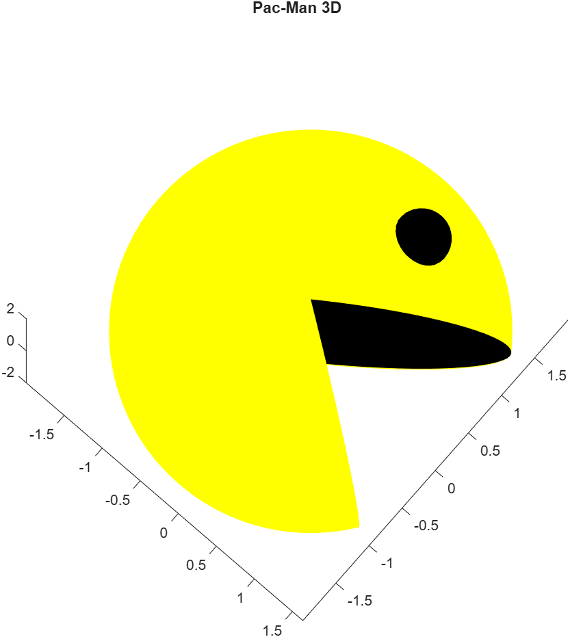

# 3D Modeling & Digital Image Processing (MATLAB) 🎨

Il repository raccoglie una serie di progetti focalizzati sulla geometria computazionale e sull'elaborazione digitale delle immagini, dimostrando l'applicazione di algoritmi numerici per la modellazione e la manipolazione di dati visuali .

---

## 🛠️ Progetti Principali

### 1. Curva Interpolante Interattiva (`Curva_interpolante_interattiva.m`)
* **Algoritmo**: Implementazione dell'**algoritmo di De Boor** per la valutazione e il rendering di curve B-spline.
* **Interattività**: Utilizzo della funzione `ginput` per l'inserimento dinamico dei nodi di controllo direttamente sull'interfaccia grafica.
* **Dettaglio Tecnico**: Calcolo ricorsivo dei punti della curva basato su un vettore dei nodi (*knots*) personalizzato per garantire la fluidità del tratto calligrafico.

### 2. Modellazione Geometrica 3D (`Pacman3D.m`, `Sedia3D.m`)
* **Pacman 3D**: Generazione di un modello tridimensionale tramite **superfici parametriche** in coordinate sferiche.
* **Sedia 3D**: Costruzione di un oggetto solido complesso mediante la composizione di primitive geometriche, utilizzando `patch` per le superfici piane e mesh cilindriche per le strutture portanti.
* **Rendering**: Implementazione di modelli di illuminazione *Gouraud* e gestione avanzata di luci e prospettiva (`camlight`, `view`) per un output fotorealistico.

### 3. Image Filtering & Processing (`Ritocco.m`)
Implementazione di algoritmi per la manipolazione di immagini digitali tramite trasformazioni puntuali sulle matrici di pixel:
* **Filtro Negativo**: Trasformazione lineare inversa dello spazio colore ($y = 255 - x$).
* **Filtro Esponenziale**: Mapping non lineare dei valori di intensità per l'espansione del contrasto.
* **Riduzione Colori**: Algoritmo di quantizzazione (K8) per la riduzione della profondità di bit dell'immagine.
* **Contrasto Semplice**: Riscalamento dinamico dei valori attorno alla mediana per l'ottimizzazione della gamma dinamica.

---

## ⚙️ Tech Stack
* **Linguaggio**: MATLAB .
* **Competenze**: Modellazione parametrica, algebra lineare applicata alla grafica, image processing .

---

## 🖼️ Gallery

---
*Progetti sviluppati nell'ambito del corso di Metodi Numerici per la Grafica.*
